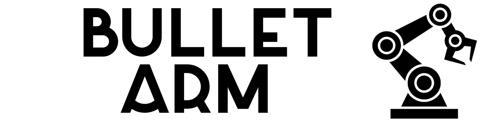

</img>

----

**[Documentation](https://colinkohler.github.io/BulletArm/)** | **[Paper](https://arxiv.org/abs/2205.14292)** | **[License](https://github.com/ColinKohler/BulletArm/blob/main/LICENSE)**

**BulletArm** is a benchmark and learning-environment for robotic manipulation. BulletArm provides a set of standardized 
benchmark tasks in simulation alongside a collection of baseline algorithms.

## Table of Contents
1. [Announcements](#anouncements)
2. [Installation](#install)
3. [Getting Started](#getting_started)
4. [Contributions](#contributions)
5. [Cite](#cite)

<a name="announcements"></a>
## Announcements

### June 24, 2022
- <b>Version 1.0.0 is live!</b>

<a name="install"></a>
## Install
1. Clone this repo
    ```
    git clone https://github.com/ColinKohler/BulletArm.git
    cd BulletArm
    ```
2. Install dependencies
    ```
    pip install -r requirements.txt 
    ```
3. Install this package
    ```
    pip install .
    ```
    Or add to your PYTHONPATH
    ```
    export PYTHONPATH=/path/to/BulletArm/:$PYTHONPATH
    ```
4. Run the block stacking demo
    ```
    python tutorials/block_stacking_demo.py
    ```

<a name="getting_started"></a>
## Getting Started
To get started with BulletArm please see the [Getting Started section](https://colinkohler.github.io/BulletArm/api/getting_started.html) of
the documentation.

<a name="contributions"></a>
## Contributions
We hope that other researchers will help us extend this package by adding new tasks, robots, etc. Please see the 
[Contributions section](https://colinkohler.github.io/BulletArm/api/contributions.html) of the documentation for additional details.

<a name="cite"></a>
## Cite
The development of this package was part of the work done for our paper: [BulletArm: An Open-Source Robotic Manipulation
Benchmark and Learning Framework](https://arxiv.org/abs/2205.14292). Please cite this work if you use our code:
```
@misc{https://doi.org/10.48550/arxiv.2205.14292,
      doi = {10.48550/ARXIV.2205.14292},
      url = {https://arxiv.org/abs/2205.14292},
      author = {Wang, Dian and Kohler, Colin and Zhu, Xupeng and Jia, Mingxi and Platt, Robert},
      keywords = {Robotics (cs.RO), FOS: Computer and information sciences, FOS: Computer and information sciences},
      title = {BulletArm: An Open-Source Robotic Manipulation Benchmark and Learning Framework},
      publisher = {arXiv},
      year = {2022},
      copyright = {arXiv.org perpetual, non-exclusive license}
} 
```
Feel free to [contact us](mailto:kohler.c@northeastern.edu).

## License
*BulletArm* is distributed under GNU General Public License. See [License](https://github.com/ColinKohler/BulletArm/blob/main/LICENSE).
