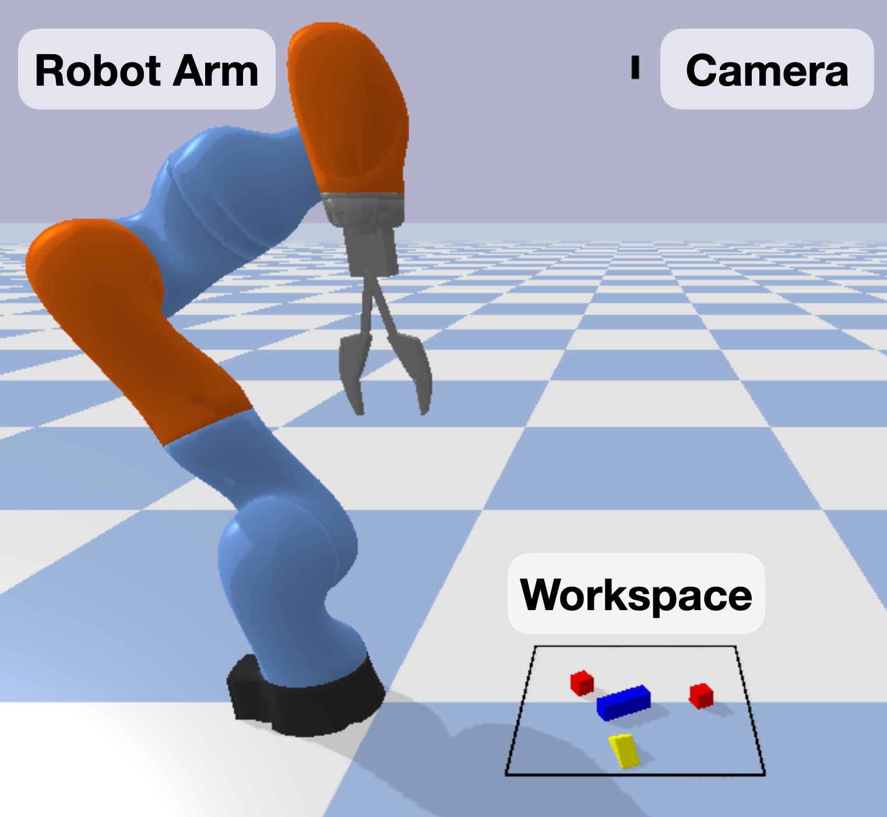
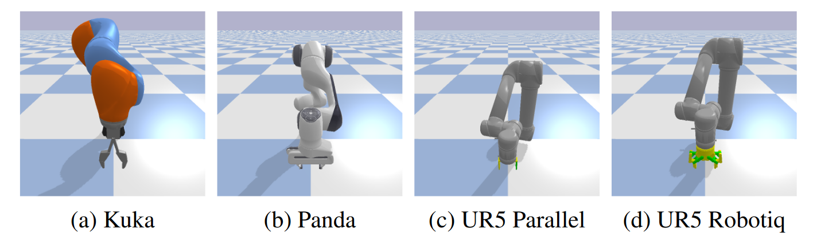

.. automodule:: bulletarm

.. |check| unicode:: U+2611 .. CHECKMARK 
.. |nocheck| unicode:: U+2610 .. NO_CHECKMARK 

BulletArm Simulator
=====================

This is the main package for the BulletArm library. It contains the PyBullet simulation environments, robots, and task definitions.
The simulation workspace consists of a robot arm mounted on the floor of the simulation environment, a workspace where objects are 
generated, and sensor(s). There are three key terms within BulletArm: *Enviornment*, *Configuration*, and *Episode*. An *environment*
is an instance ofthe PyBullet simulator in which the robot interacts with objects while trying to solve some task. This include the 
initial environment state, the reward function, and termination requirements. A *configuration* contains additional specifications
for the task such as the robot arm, the size of the workspace, the physics mode, etc. A full list of parameters can be found here.
*Episodes* are generated by taking actions (steps) within an environment until the episode ends.

  
  The simulation environment containing a robot arm, a camera, and a workspace.

----

Tasks
-----------------
Our set of tasks are seperated into two categories based on the action space: open-loop control and closed-loop control.
Future work is planned to allow all tasks to use either control-type but for now the below table shows current avaliable
control type for each task. For each avaliable task, the name required by the :code:`EnvFactory` to initalize that task
is also shown.

.. list-table::
  :widths: 25 25 25 
  :header-rows: 1
  :align: center

  * - Task
    - Open-Loop
    - Closed-Loop
  * - :ref:`Block Reaching` 
    - |nocheck| 
    - |check| :code:`close_loop_block_reaching`
  * - :ref:`Block Pushing` 
    - |nocheck| 
    - |check| :code:`close_loop_block_pushing`
  * - :ref:`Block Pulling` 
    - |nocheck| 
    - |check| :code:`close_loop_block_pulling`
  * - :ref:`Block Picking` 
    - |check| :code:`block_picking`
    - |check| :code:`close_loop_block_picking`
  * - :ref:`Block Stacking` 
    - |check| :code:`block_stacking`
    - |check| :code:`close_loop_block_stacking`
  * - :ref:`Block In Bowl` 
    - |nocheck| 
    - |check| :code:`close_loop_block_in_bowl`
  * - :ref:`House Building 1` 
    - |check| :code:`house_building_1` 
    - |check| :code:`close_loop_house_building_1`
  * - :ref:`House Building 2` 
    - |check| :code:`house_building_2`
    - |nocheck| 
  * - :ref:`House Building 3` 
    - |check| :code:`house_building_3`
    - |nocheck| 
  * - :ref:`House Building 4` 
    - |check| :code:`house_building_4`
    - |nocheck| 
  * - :ref:`Improvise House Building 2` 
    - |check| :code:`improvise_house_building_2`
    - |nocheck| 
  * - :ref:`Improvise House Building 3` 
    - |check| :code:`improvise_house_building_3`
    - |nocheck| 
  * - :ref:`Bin Packing` 
    - |check| :code:`block_bin_packing` 
    - |nocheck| 
  * - :ref:`Bottle Arrangement` 
    - |check| :code:`bottle_tray` 
    - |nocheck| 
  * - :ref:`Box Palletizing` 
    - |check| :code:`box_palletizing`
    - |nocheck| 
  * - :ref:`Covid Test`
    - |check| :code:`covid_test` 
    - |nocheck| 
  * - :ref:`Corner Picking`
    - |nocheck| 
    - |check| :code:`close_loop_block_picking_corner`
  * - :ref:`Drawer Opening`
    - |nocheck| 
    - |check| :code:`close_loop_drawer_opening` 
  * - :ref:`Object Grasping`
    - |check| :code:`clutter_picking` 
    - |check| :code:`close_loop_clutter_picking` 

----

EnvFactory & EnvRunner
-----------------------
Interaction with BulletArm is done through the :code:`EnvFactory` and :code:`EnvRunner` classes. 
The :code:`EnvFactory` is the entry point and creates the *environment* specified by the *configuration* passed as input. The :code:`EnvFactory`
can create either a single environment (SingleRunner) or multiple environments (MultiRunner) to be run in parallel.
The :code:`EnvRunner` provides the API which interacts with the environment. This API is modeled after the typical agent-environment
RL setup popularized by OpenAI Gym.

EnvFactory
~~~~~~~~~~~

.. automodule:: bulletarm.env_factory
  :members:

EnvRunner
~~~~~~~~~~
.. autoclass:: bulletarm.runner.MultiRunner
  :members:

.. autoclass:: bulletarm.runner.SingleRunner
  :members:

----

Configuration Parameters
--------------------------

A task in BulletArm is defined as the combination of the environment and the configuration
passed to that environemnt. The environment details the high level details for the task i.e.
the initial state, goal state, invalid states, etc. The configuration contains lower level details which
can add to task variety. The default config can be found `here <https://github.com/ColinKohler/BulletArm/blob/main/bulletarm/envs/configs.py>`_.
We briefly detail the various config parameters below but additional information can be found in the default config.

.. list-table::
  :widths: 25 25 25
  :header-rows: 1
  :align: center

  * - Parameter 
    - Example
    - Description 
  * - render
    - False/True
    - Render the PyBullet GUI or run headless
  * - max_steps
    - 10
    - The maximum number of steps per episode.
  * - workspace
    - [[0, 0.2], [0, 0.2], [0, 0.2]]
    - The workspace in terms of the range in x, y, and z.
  * - workspace_check
    - point/bounding_box
    - How to determine if a object is within the workspace by either check the COM of the object of the bounding box.
  * - robot 
    - kuka
    - The type of the robot to use in the simulator. 
  * - action_sequence
    - pxyzr
    - The action space the agent will act within. 'pxyzr' defines a 5-vector action including the gripper action (p), the position of the gripper (x,y,z),
      and its top-down rotation (r). 
  * - obs_size
    - 128
    - The pixel size of the heightmap.
  * - in_hand_size
    - 24
    - The pixel size of the in-hand image.
  * - random_orientation
    - True
    - Whether or not to generate objects with a random orientation
  * - object_scale_range
    - [0.6, 0.7]
    - The scale applied to objects in the workspace. Addes variation and helps with generalization.
  * - fast_mode
    - False/True
    - If True, teleports the arm when possible to speed up simulation. Bad for more dynamical domains & closed-loop control.
  * - phyics_mode
    - fast, slow
    - The type of physics to use during simulation. Can be run faster with less accurate physics or slower with more accurate physics.
  * - num_objects
    - 3
    - Specifies the number of objects to generate in domains which have a variable number of objects.

----

Robots
-----------
Different robotic arms can lead to drastically different policies due to the differing kinematics between arms. We
provide four robotic arms: KUKA IIWA, Frane Emika Panda, Universal Robots UR5 with a parallel jaw gripper, and 
Universal Robots UR5 with Robotiq 2F-85 gripper. To add a new manipulator see the `new robot tutorial <https://github.com/ColinKohler/BulletArm/blob/main/tutorials/new_robot.py>`_. 

  
  Currently supported robotic arms.

----

Objects
--------

We provide a number of objects to use out-of-the-box when creating new tasks. The list of avaliable objects can be 
seen below. Objects are generating within the workspace by using the :code:`_generateShapes` function in the base
enviornment. Objects are identified by their ID which is located in :code:`bulletarm/pybullet/utils/constants.py`.
To add a new object see the `new object tutorial <https://github.com/ColinKohler/BulletArm/blob/main/tutorials/new_object.py>`_.

.. list-table::
  :widths: 5
  :header-rows: 1
  :align: center

  * - Object
  * - Cube
  * - Sphere
  * - Cylinder 
  * - Cone 
  * - Brick
  * - Triangle 
  * - Roof
  * - Teapot
  * - Teapot Lid 
  * - Cup
  * - Bowl
  * - Plate
  * - Spoon
  * - Bottle
  * - Box
  * - Pallet
  * - Test Tube
  * - Swab
  * - Flat Block
  * - Random Household 200
  * - Grasp Net 

.. autofunction:: bulletarm.envs.base_env.BaseEnv._generateShapes
