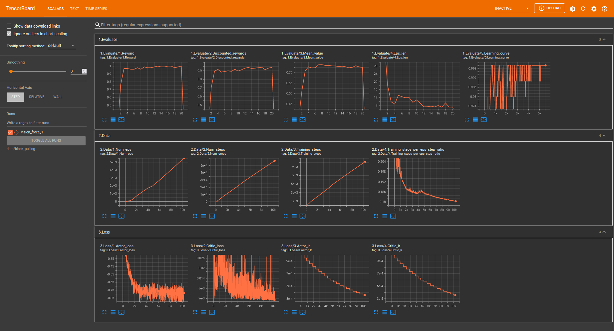

.. automodule:: bulletarm_baselines

BulletArm Baselines
====================

This subpackage implements a collection of state-of-the-art baseline algorithms to benchmark new methods against. 
The algorithms provided cover a wide range of state and action spaces for either open-loop control or close-loop 
control. Additionally, we provide a number of logging and plotting utilities for ease of use.

----

Open-Loop Benchmarks
---------------------

Prerequisite
~~~~~~~~~~~~~
1. Install `PyTorch <https://pytorch.org/>`_ (Recommended: pytorch==1.7.0, torchvision==0.8.1)

2. (Optional, required for 6D benchmark) Install `CuPy <https://github.com/cupy/cupy>`_

3. Install other required packages

.. code-block:: bash

  pip install -r baseline_requirements.txt
    
4. Goto the baseline directory

.. code-block:: bash

  cd helping_hands_rl_envs/helping_hands_rl_baselines/fc_dqn/scripts

Open-Loop 2D Benchmarks
~~~~~~~~~~~~~~~~~~~~~~~~
.. code-block:: bash

  python main.py  --algorithm=[algorithm] --architecture=[architecture] --action_sequence=xyp --random_orientation=f --env=[env]

- Select :code:`[algorithm]` from: :code:`sdqfd` (recommended), :code:`dqfd`, :code:`adet`, :code:`dqn`
- Select :code:`[architecture]` from: :code:`equi_fcn` (recommended), :code:`cnn_fcn`
- Add :code:`--fill_buffer_deconstruct` to use deconstruction planner for gathering expert data.

Open-Loop 3D Benchmarks
~~~~~~~~~~~~~~~~~~~~~~~~
.. code-block:: bash

  python main.py --algorithm=[algorithm] --architecture=[architecture] --env=[env]

- Select :code:`[algorithm]` from: :code:`sdqfd` (recommended), :code:`dqfd`, :code:`adet`, :code:`dqn`
- Select :code:`[architecture]` from: :code:`equi_asr` (recommended), :code:`cnn_asr`, :code:`equi_fcn`, :code:`cnn_fcn`, :code:`rot_fcn`
- Add :code:`--fill_buffer_deconstruct` to use deconstruction planner for gathering expert data.

Open-Loop 6D Benchmarks
~~~~~~~~~~~~~~~~~~~~~~~~
.. code-block:: bash

  python main.py  --algorithm=[algorithm] --architecture=[architecture] --action_sequence=xyzrrrp --patch_size=[patch_size] --env=[env]

- Select :code:`[algorithm]` from: :code:`sdqfd` (recommended), :code:`dqfd`, :code:`adet`, :code:`dqn`
- Select :code:`[architecture]` from: :code:`equi_deictic_asr` (recommended), :code:`cnn_asr`
- Set :code:`[patch_size]` to be :code:`40` (recommended, required for `bumpy_box_palletizing` environment) or :code:`24`
- Add :code:`--fill_buffer_deconstruct` to use deconstruction planner for gathering expert data.

Additional Training Arguments
~~~~~~~~~~~~~~~~~~~~~~~~~~~~~~
See `bulletarm_baselines/fc_dqn/utils/parameters.py <https://github.com/ColinKohler/BulletArm/blob/main/bulletarm_baselines/fc_dqn/utils/parameters.py>`_

----

Close-Loop Benchmarks
----------------------

Prerequisite
~~~~~~~~~~~~~
1. Install `PyTorch <https://pytorch.org/>`_ (Recommended: pytorch==1.7.0, torchvision==0.8.1)
2. Install other required packages

.. code-block:: bash

    pip install -r baseline_requirements.txt

3. Goto the baseline directory

.. code-block:: bash

    cd helping_hands_rl_envs/helping_hands_rl_baselines/equi_rl/scripts

Close-Loop 3D Benchmarks
~~~~~~~~~~~~~~~~~~~~~~~~~

.. code-block:: bash

  python main.py --algorithm=[algorithm] --action_sequence=pxyz --random_orientation=f --env=[env]

- Select :code:`[algorithm]` from: :code:`sac`, :code:`sacfd`, :code:`equi_sac`, :code:`equi_sacfd`, :code:`ferm_sac`, :code:`ferm_sacfd`, :code:`rad_sac`, :code:`rad_sacfd`, :code:`drq_sac`, :code:`drq_sacfd`

Close-Loop 4D Benchmarks
~~~~~~~~~~~~~~~~~~~~~~~~~

.. code-block:: bash

  python main.py --algorithm=[algorithm] --env=[env]

- Select `[algorithm]` from: :code:`sac`, :code:`sacfd`, :code:`equi_sac`, :code:`equi_sacfd`, :code:`ferm_sac`, :code:`ferm_sacfd`, :code:`rad_sac`, :code:`rad_sacfd`, :code:`drq_sac`, :code:`drq_sacfd`
- To use PER and data augmentation buffer, add :code:`--buffer=per_expert_aug`

Additional Training Arguments
~~~~~~~~~~~~~~~~~~~~~~~~~~~~~~
See `bulletarm_baselines/equi_rl/utils/parameters.py <https://github.com/ColinKohler/BulletArm/blob/main/bulletarm_baselines/equi_rl/utils/parameters.py>`_

----

Logging & Plotting Utilities
-----------------------------
To assist with debugging new algorithms, we include the logging and plotting tools which we use for the baselines. The logger wraps Tensorboard
and provides numerous functions to log various details of the training process. An example of the information the logger displays can be seen below.
In addition to the default data, any additional data can be added as desired using the :code:`updateScalars()` function. The plotter is currently in
its infancy but provides a easy way to plot and compare different algorithms when using the provided logger.

  
  An example run showing the default information captured by the logger.

Logger
~~~~~~~
.. automodule:: bulletarm_baselines.logger.logger
  :members:

Plotter
~~~~~~~~
.. automodule:: bulletarm_baselines.logger.plotter
  :members:

