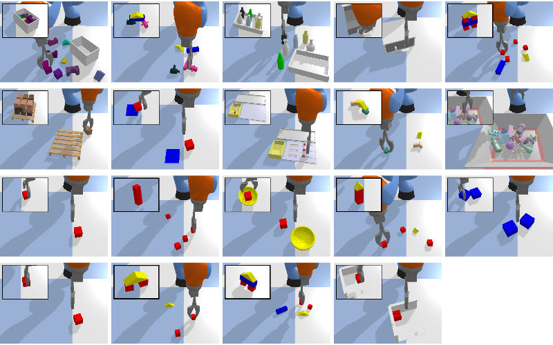

.. BulletArm documentation master file, created by
   sphinx-quickstart on Tue Jan 18 13:15:56 2022.
   You can adapt this file completely to your liking, but it should at least
   contain the root `toctree` directive.

:github_url: https://github.com/ColinKohler/BulletArm

**BulletArm** is a PyBullet based benchmark and learning-environment for robotic manipulation research.
The development of this package was part of the work done in our `ISRR 22 paper <https://arxiv.org/abs/2205.14292>`_.

This package is mainly comprised of two sub-packages: the :doc:`BulletArm Simulator <api/bulletarm>` and 
the :doc:`BulletArm Baselines <api/bulletarm_baselines>`. The simulator provides numerous tools to enable
rapid development of robotic manipulation environments for use in robotic learning. It provides a number 
of environemnts, robots, planners, and tasks out-of-the-box. Additionally, BulletArm was designed with
an emphasis on extensibility, allowing users to easily create new enviornments, tasks, and robots as needed.
We aim to maintain and improve this package adding new features over time and hope to encourage the community
to assist with this by adding any interesting tasks they might design.

Through the combination of these tasks with the provided baselines, we present a comprehensive benchmark for
use in either open-loop or closed-loop control. This benchmark consists of 19 different manipulation tasks 
of varying difficuly, ranging from simple reaching and picking tasks to more realistic tasks such as bin packing
and pallet stacking. These tasks can be seen below (for more information see :doc:`Benchmark Tasks <api/tasks>`).
We provide state-of-the-art baseline algorithms allowing users to compare their algorithms to our previous work 
on any of the existing tasks or novel tasks which they create.

  Benchmark Tasks.
  
Package Reference
--------------------------------------------

* :doc:`Getting Started: <api/getting_started>` Helpful introductory material including installation instructions, examples, and tutorials.
* :doc:`BulletArm Simulator: <api/bulletarm>` Robotic simulator including the PyBullet environments, robots, tasks, and more.
* :doc:`BulletArm Baselines: <api/bulletarm_baselines>` A collection of state-of-the-art baseline algorithms to benchmark new methods against.
* :doc:`Benchmark Tasks: <api/tasks>` The core set of tasks used for benchmarking methods. 

.. toctree::
  :glob:
  :maxdepth: 1
  :caption: Package Reference
  :hidden:

  BulletArm <self>
  api/getting_started
  api/bulletarm
  api/bulletarm_baselines
  api/tasks
  api/contributions

Contribute
---------------
We hope that other researchers will help us extend this package by adding new tasks, robots, etc.
If you wish to contribute, please see :ref:`Contributions` for additional details.

Cite Us
--------------------------------------------
The development of this package was part of the work done in our ISRR 22 paper. Please,
cite us if you use this code in your own work::

  @misc{https://doi.org/10.48550/arxiv.2205.14292,
    doi = {10.48550/ARXIV.2205.14292},
    url = {https://arxiv.org/abs/2205.14292},
    author = {Wang, Dian and Kohler, Colin and Zhu, Xupeng and Jia, Mingxi and Platt, Robert},
    keywords = {Robotics (cs.RO), FOS: Computer and information sciences, FOS: Computer and information sciences},
    title = {BulletArm: An Open-Source Robotic Manipulation Benchmark and Learning Framework},
    publisher = {arXiv},
    year = {2022},
    copyright = {arXiv.org perpetual, non-exclusive license}
  }

Indices and tables
------------------
* :ref:`genindex`
* :ref:`modindex`
